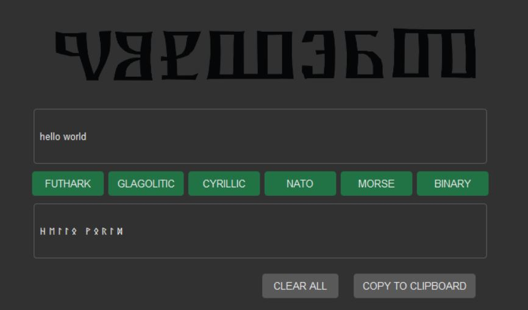

# TranscribeMe

This converter app enables the user to transcribe the latinic script into five other alphabetic systems with just a press of a corresponding button. 

# Special Remarks
- The converter is optimised for using English or Croatian as input languages and their corresponding special characters

- The principle of romanisation was used to switch respective non-existing characters according to the following formula:
- Y X Q W - j ks kv v - for English into Cyrillic and Glagolitic
- Č Ć Đ DŽ Š Ž - ch ch dj dj sh zh - for Croatian into Futhark and NATO

- The Cyrillic script uses the Serbian variation

# The Idea
Ever since I encountered the Glagolitic script in school, I have been fascinated with different writing systems, both dead and those still in use today. I learned to use the Glagolitza at the age of 8, and Futhark at the age of 12. Both were usually used to pass secret notes to my classmates, or just for fun. 

Recently, I took it upon myself to learn the Cyrillic Alphabet, too, as I thought that could actually be a useful skill in the 21st century, compared to these two dead scripts, as many Slavic countries still use it as their official orthographies (albeit each their own slightly modified versions). Today I can write and read in these three writing systems _fluently_, while also learning Morse code and the Greek Alphabet. 

When I started learning Python, I wanted to build a different project than those usually suggested for beginners, such as the Pomodoro clock or a Password manager, to utilize my freshly learned skills in file management and buidling a functional UI. Combining my passion for all things linguistic with my programming skills turned out to be a great idea. 

# Possible Improvements
- Given its simple nature, this converter would definitely be more suitable as a mobile app
- When transcribing English into Cyrillic, it would perhaps be an interesting challenge to fully implement Vuk's Orthographic Norm through Oxford's phonetic transcription API so that the text truly corresponds to the way in which it would be written in Serbia, in essence, "write as you would say it". 
- Implement the conversion into the Greek Alphabet
